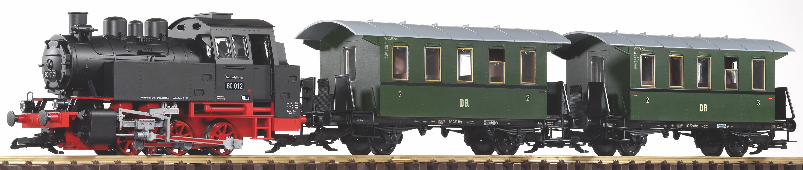

# Project-Train 

## Doel project
Ons project zal worden gebruikt in een escape room. 
De bedoeling is dat er allerlei dingen gebeuren in de kamer om de sperlers
hun aandacht te trekken. Onze trein zal daar bij horen.
De trein zal in een tijd van 10sec naar de overkant van de kamer 
moeten rijden. Dit zal allemaal automatisch gebeuren. 
Ook zal er een ledstip die aan de muur gangt de trein moeten volgen.

### H-Brug
Aan de hand van de H-Brug zullen we de trein aumtomatisch doen rijden. De snelheid
en de richting waarin de trein rijdt kan worden bepaald. De trein wordt geleverd met 
een draai knop om de snelheid en richting te bepalen de H-Brug zal deze dan vervangen.
Doordat we onze componenten te laat binnen kregen en een snelle oplossing moesten zoeken hiervoor
hebben we een andere component gebruikt. 

### Ledstrip
De led strip zal de trein moeten volgen zodat de aandacht
van de spelers naar de trein gaat. Dit zal gebeuren aan de hand van 
sensors die onder de trein staan. Zo kunnen we perfect weten waar de trein zich
bevint en kunnen we de ledstip programeren. We maken gebruik van een infrarood LED en een sensor. Wanneer er een object, de trein in ons geval, over deze LED en sensor rijdt zal de sensor een digitale '1' uitsturen.
In totaal hebben we 8 LEDs en sensoren, hierdoor krijgen we 8 nulletjes en eentjes binnen. Wanneer er dus een reeks van eentjes binnenkomt weten we dat de trein zich daar bevindt. Doordat we weten waar de trein zich bevindt 
kunnen we zo de LEDs aansturen om te branden waar we een '1' binnenlezen en niet te branden waar we een '0' binnenlezen.

### De sensor 
De sensoren die zich onder de trein bevinden zullen uit een fototransistor en
een infrarood led bestaan. Wanneer de trein over de sensor rijdt zal
er door de weerkaatsing van het licht een signaal worden binnengelezen. Dit signaal
kunnen we dan gebruiken. Omdat we heel wat sensors hebben gaan we deze binnen 
lezen aan de hand van schuifregisters.

### Lichten in de trein
Dit is even op hold gezet omdat er balangrijkere dingen waren maar, de bedoeling was dat
er 2 koperen staven op het spoor kwamen te liggen die verbonden zijn met een DC-DC convertor.
Hierop komen 2 veren die vasthangen aan de laatste wagon die ervoor zorgt dat de schakeling in de 
wagon voeding krijgt. De staven lopen niet helemaal door, daarom zou er een condensator in de schakeling 
zitten die na het opladen en het verlaten van de koperen staven zorgt dat de schakeling nog spanning heeft voor derest van het traject.

