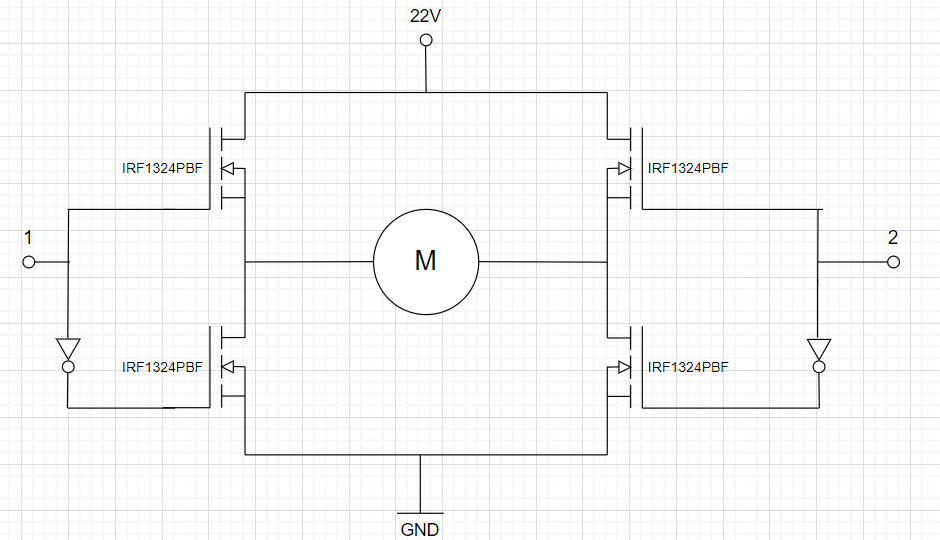
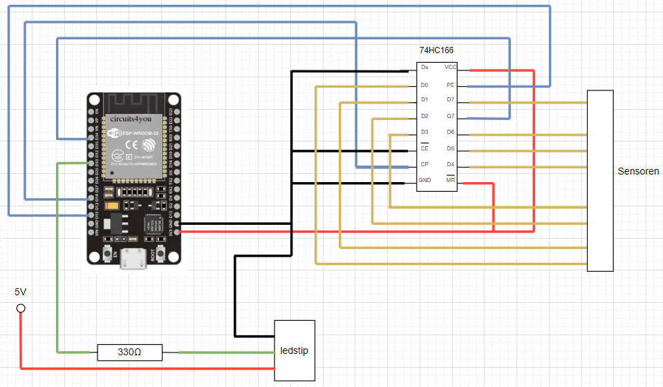

# Uitleg schakelingen
## Sensor

Dit schema wordt gesoldeerd op een gaatjes print, deze zullen dan tussen
het spoor komen te liggen. Het infrarood licht van de LED zal worden weerkaatst als de trein
er over rijdt waardoor dit licht valt op de fototransistor. Deze zal in geleiding 
treden waardoor de spanning volledig over de weerstand(22kΩ) komt te staan. 
Nu krijg je een logisch '1' op de signaalpin. Dit signaal wordt aangesloten aan een schuifregister. 
[Aansluit schema ESP32 devkit](#aansluit-schema-esp32-devkit)

## H-Brug

De H-Brug wordt gebruikt om de trein te doen rijden. Hiermee kan je de snelheid en de richting
van de trein bepalen. Aan de pinnen 1 en 2 wordt een logisch '0' of een PWM signaal gelegd. De richting 
van de motor hangt af van welke pin een PWM signaal bavat. De ander pin moet verplicht een logisch '0' zijn 
omdat je anders met een kortsluiting zit. De snelheid van de trein wordt bepaald door je PWM signaal.
In ons geval nemen we een PWM met duty cycle van 66%. Hoe groter deze duty cycle is hoe sneller de
motor zal draaien. 

## Aansluit schema ESP32 devkit
